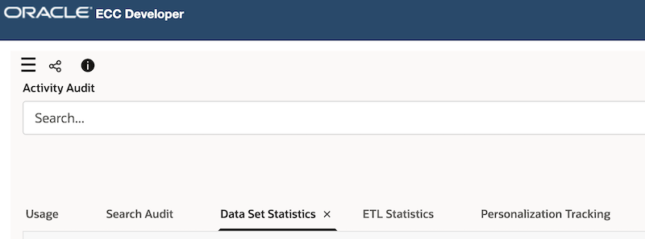
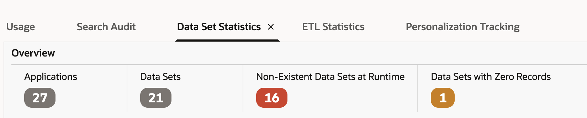
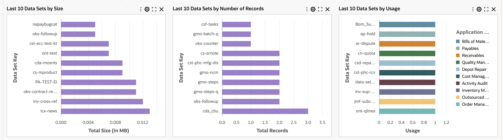

# Dataset Statistics

Introduced in ECC V12, **Dataset statistics** helps the System Administrator understand ECC footprint. Metadata is static data that does not change between environments. This may not be sufficient for the System Administrator to take decisions. There is a need for runtime insight into the dataset. Some insights: How many datasets are there in total ? How many datasets are not being used - where full load was not run to investigate if it was intentional.

# Insights

Dataset statistics is a dashboard invoked from the Activity Audit. ECC Developer -> Activity Audit. It is **automatically** scheduled. When new datasets are added, they are also accounted for without needing to 

## Structure of the Dataset statistics Dashboard:
* Dataset statistics has a summary bar at the top with 4 flags, charts in the middle that show the dataset pattern , and a result table at the bottom

## Summary bar components
There are flags are shown in the summary 
* **Applications** - How many applications are imported and active ? 
* **Total Datasets** - How many datasets are active ?
* **Non-Existent datasets at runtime** - Full load is **not** run for these datasets? These can be investigated
* **Datasets with 0 records** - If there are datasets listed  in this flag, are the product profiles correctly set ? It is expected to have 0 records ? Example - Payables Holds can show 0 if there are genuinely **No Holds**

## Quick look at the charts

There are 3 charts that are shipped.
* Last 10 datasets by size 
* Last 10 datasets by Number of records 
* Last 10 datasets by usage.
The first two datasets should show a similar pattern, as there is a correlation between recordset size and number of records. 
What questions does this chart answer ? 
* Are there any datasets which have many records  but are not used ? 
* Are there any datasets that are frequently used,but dont have records ? Why is it used frequently 
## Summary
Dataset Statistics dashboard is an important tool for the System Administrator to assess if there is any corrective action to be done. There may be datasets that are rarely used, but occupy a lot of space , (Bringing too much historical data possibly?)
